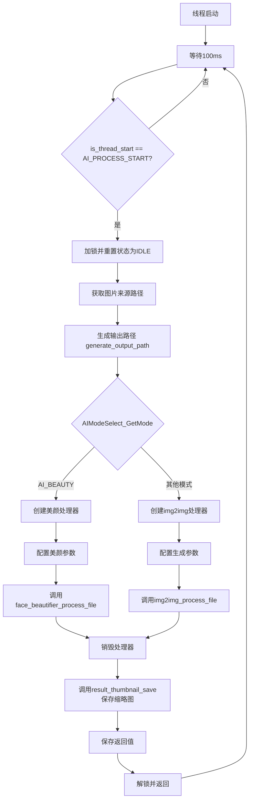
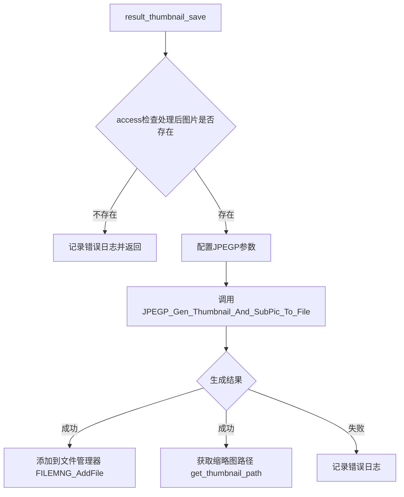

# AI图片处理模块文档

## 文件信息

| 属性 | 值 |
|------|-----|
| 文件路径 | `src/guiguider_ui/aiprocess/image_process.c` |
| 功能描述 | AI图片处理模块，支持美颜和图像生成功能 |
| 依赖线程 | `thread_ai_process_main()` |

## 功能概述

本模块用于在拍照页面进入AI模式时处理图片，支持两种处理模式：

- **美颜处理** (`AI_BEAUTY`)：调用人脸美化API对图片进行美颜
- **图像生成** (`img2img`)：根据提示词生成指定风格的图片（场景/背景/年龄切换）

模块采用独立线程处理AI任务，通过状态机控制处理流程。

## 线程处理流程图

## 关键函数说明

### 状态控制接口

| 函数名 | 功能描述 |
|--------|----------|
| `ai_process_state_set(bool state)` | 设置AI处理线程状态，控制任务启动/停止 |

### 结果管理接口

| 函数名 | 功能描述 |
|--------|----------|
| `aiprocess_set_prompt(const char* word)` | 设置AI图像生成的提示词 |
| `aiprocess_clean_cache(void)` | 清空处理结果路径 |
| `process_result_get(void)` | 获取AI处理后的图片路径 |
| `process_result_get_thumbnail(void)` | 获取处理后图片的缩略图路径 |
| `get_retval(void)` | 获取API调用返回值 |
| `set_defalt_retval(void)` | 重置返回值为默认状态 |

### 内部处理函数

| 函数名 | 功能描述 |
|--------|----------|
| `generate_output_path(input_path, output_path, size)` | 根据输入路径生成唯一的输出路径，自动处理文件名去重 |
| `result_thumbnail_save(char* img_path)` | 生成并保存AI处理后图片的缩略图 |
| `thread_ai_process_main(void* arg)` | AI处理主线程函数，循环检测状态并执行处理任务 |

## 全局变量

| 变量名 | 类型 | 说明 |
|--------|------|------|
| `is_thread_start` | bool | 线程控制状态，`AI_PROCESS_START`启动处理，`AI_PROCESS_IDLE`空闲 |
| `g_input_img_path` | char[256] | 输入图片路径 |
| `g_output_img_path` | char[256] | 输出图片路径 |
| `g_output_thumb_path` | char[256] | 输出缩略图路径 |
| `g_style_prompt` | char[1024] | AI图像生成提示词 |
| `g_api_retval` | int | API调用返回值，记录处理结果 |

## 常量定义

| 常量名 | 值 | 说明 |
|--------|-----|------|
| `AI_OUT_IMG_WIDTH` | 960 | AI输出图片宽度 |
| `AI_OUT_IMG_HEIGHT` | 720 | AI输出图片高度 |
| `SUBPIC_WIDTH` | 640 | 子图宽度 |
| `SUBPIC_HEIGHT` | 480 | 子图高度 |
| `THUMBNAIL_WIDTH` | 200 | 缩略图宽度 |
| `THUMBNAIL_HEIGHT` | 140 | 缩略图高度 |

## 互斥锁保护

| 锁名称 | 保护对象 | 用途 |
|--------|----------|------|
| `processor_mutex` | 处理器状态和全局变量 | 防止并发访问处理资源和全局状态 |

## 文件名处理逻辑

`generate_output_path()` 函数实现了智能文件名生成规则：

1. **提取基础文件名**：从输入路径解析文件名，去除扩展名
2. **检查现有后缀**：使用 `sscanf` 识别是否已有 `_AI{NNNN}` 后缀
3. **序号递增**：
   - 输入 `DCIM0001.jpg` → 输出 `DCIM0001_AI0001.jpg`
   - 输入 `DCIM0001_AI0002.jpg` → 输出 `DCIM0001_AI0003.jpg`
4. **去重处理**：通过 `access()` 检测文件是否存在，直到找到不存在的序号

**格式说明**：
- 后缀格式：`_AI` + 4位数字（如 `_AI0001`）
- 序号范围：0001 ~ 9999
- 超出范围时返回空字符串并记录错误

## 缩略图生成流程

## 外部依赖

| 依赖模块 | 用途 |
|----------|------|
| `face_beautifier` | 美颜处理API |
| `img2img` | 图像生成API |
| `jpegp` | JPEG编解码和缩略图生成 |
| `extract_thumbnail` | 路径修复（fix_path_validity）、获取缩略图路径 |
| `page_all.h` | 页面管理接口（`is_album_pic`、`get_curr_pic_path` 等） |
| `config.h` | 配置参数（API密钥、路径等） |

## 修改记录

### 2026-01-07: 重构路径生成和缩略图保存逻辑

**代码优化**：
1. 移除 `ai_param_mutex`，简化锁的使用
2. `generate_output_path()` 改为参数化函数，接收输入/输出路径
3. `result_thumbnail_save()` 改为参数化函数，接收图片路径
4. 更新文件名生成逻辑，使用 `sscanf` 匹配 `_AI{NNNN}` 后缀
5. 移除冗余变量，统一使用 `g_input_img_path`、`g_output_img_path`

**文档更新**：
1. 更新函数说明表格
2. 更新全局变量列表
3. 更新文件名处理逻辑说明
4. 更新互斥锁保护说明
