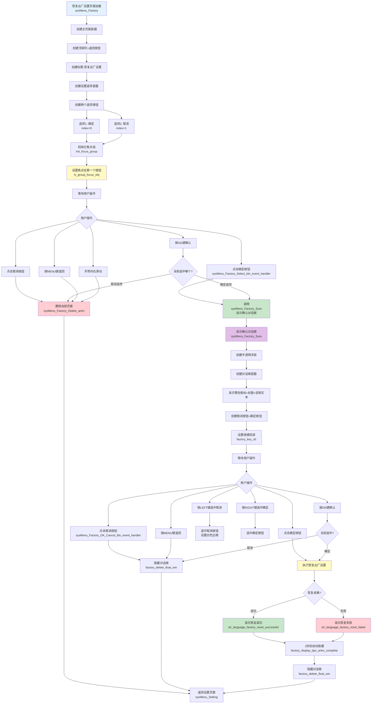
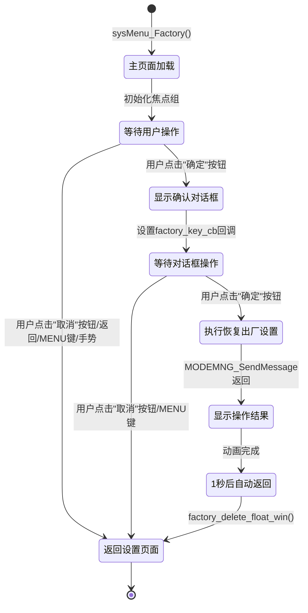

## 恢复出厂设置页面流程图

## 页面状态流程图

## 关键函数说明

### 🏁 页面入口函数
- `sysMenu_Factory(lv_ui_t* ui)`: 页面初始化函数，创建完整UI
  - 创建主页面容器（640x480）
  - 创建顶部栏和返回按钮
  - 创建"确定"和"取消"两个选项按钮
  - 初始化焦点组，支持物理按键导航

### ✅ 确认对话框相关
- `sysMenu_Factory_Sure(void)`: 显示恢复出厂设置确认对话框
  - 创建半透明浮层（70%透明度）
  - 创建居中对话框容器（500x300）
  - 显示警告图标和说明文本
  - 创建取消/确定按钮，设置`factory_key_cb`为按键处理器

### 🎮 事件回调函数
- `sysMenu_Factory_Select_btn_event_handler(lv_event_t* e)`: 主页面选项按钮点击事件
  - index=0: 显示确认对话框
  - index=1: 删除页面并返回设置页
- `sysMenu_Factory_OK_Cancel_btn_event_handler(lv_event_t* e)`: 对话框按钮点击事件
  - 取消: 调用`factory_delete_float_win()`隐藏对话框
  - 确定: 发送`EVENT_MODEMNG_SETTING`消息执行恢复出厂设置
- `sysmenu_factory_click_callback(lv_obj_t* obj)`: 焦点组点击回调（触摸/OK键）
- `factory_key_cb(int key_code, int key_value)`: 物理按键处理
  - KEY_MENU: 隐藏对话框
  - KEY_LEFT: 选中取消按钮
  - KEY_RIGHT: 选中确定按钮
  - KEY_OK: 确认当前选择

### 🔄 动画与清理函数
- `sysMenu_Factory_Delete_anim(void)`: 页面删除动画（透明度渐隐）
- `factory_delete_float_win(void)`: 删除浮层并恢复焦点组
- `sysMenu_factory_Delete_Complete_anim_cb(lv_anim_t* a)`: 页面删除完成回调，返回设置页
- `factory_display_tips_anim_complete(lv_anim_t* a)`: 结果提示动画完成，隐藏对话框

### 📋 语言字符串
- `str_language_factory_reset`: "恢复出厂设置"标题
- `str_language_factory_settings`: "恢复出厂设置"对话框标题
- `str_language_are_you_sure_to_reset_to_factory_settings`: 确认提示文本
- `str_language_data_cannot_be_recovered_after_factory_reset`: 数据不可恢复警告
- `str_language_factory_reset_successful`: 恢复成功提示
- `str_language_factory_reset_failed`: 恢复失败提示

## 全局变量

| 变量名 | 类型 | 说明 |
|--------|------|------|
| `obj_sysMenu_Factory_s` | lv_obj_t* | 主页面底层窗口 |
| `obj_sysMenu_Factory_Float_s` | lv_obj_t* | 确认对话框浮层 |
| `obj_factory_dialog_s` | lv_obj_t* | 对话框内容容器 |
| `focusable_objects[]` | lv_obj_t[] | 焦点组可聚焦对象数组 |

## 按键映射

| 按键 | 主页面 | 对话框 |
|------|--------|--------|
| KEY_UP/KEY_DOWN | 切换选项 | 切换按钮选中 |
| KEY_OK | 确认当前选项 | 确认当前按钮 |
| KEY_LEFT | - | 选中取消 |
| KEY_RIGHT | - | 选中确定 |
| KEY_MENU | 返回 | 隐藏对话框 |
| 手势右滑 | 返回 | - |

## 修改记录

### 2026-01-04: 添加页面文档

**内容更新**:
1. 添加主流程图，展示页面加载和用户操作流程
2. 添加页面状态流程图，展示状态转换
3. 补充关键函数说明
4. 补充按键映射表
5. 补充全局变量说明

**相关文件**:
- `docs/page_factory.md`: 新建流程图和函数说明文档
- `src/guiguider_ui/page_sysmenu_factory.c`: 同步代码逻辑
