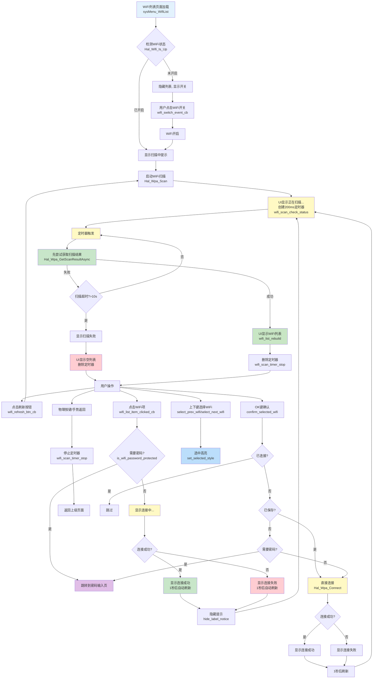
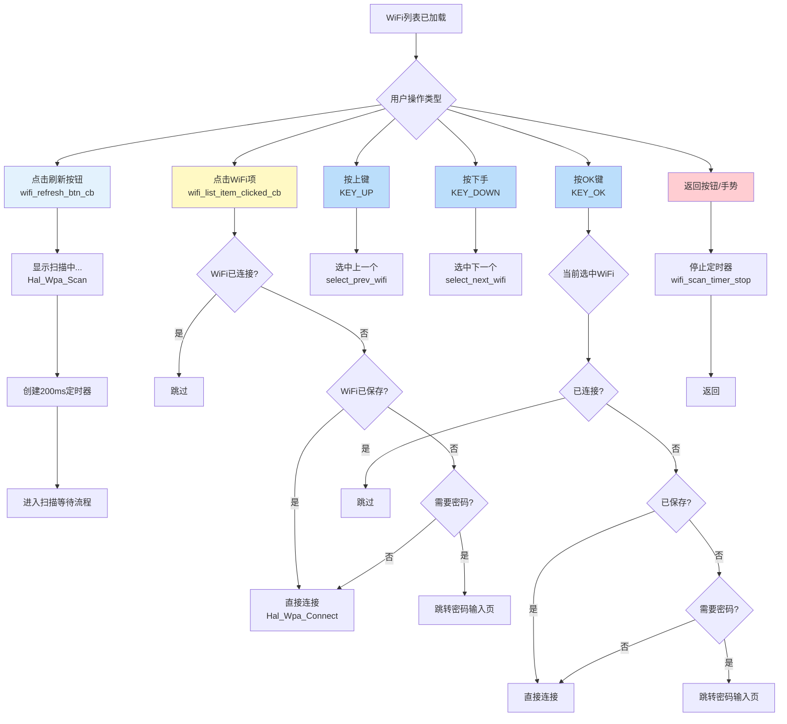

## wifi 扫描流程图

## WiFi列表操作流程图

## 关键函数说明

### 🏁 初始化函数
- `sysMenu_WifiList()`: 页面入口函数，创建UI并启动扫描

### 🔍 扫描相关
- `Hal_Wpa_Scan()`: 启动异步扫描（hal_wifi层）
- `wifi_scan_check_status()`: 定时器回调，先尝试获取扫描结果，打破循环依赖
- `Hal_Wpa_GetScanState()`: 获取扫描状态（hal_wifi层）
- `Hal_Wpa_GetScanResultAsync()`: 获取扫描结果（hal_wifi层），包含早期检测机制
- `wifi_list_rebuild()`: 重建WiFi列表UI（清空+重新创建所有项）

### 🎮 事件回调
- `wifi_switch_event_cb()`: WiFi开关事件回调（打开/关闭WiFi）
- `wifi_refresh_btn_cb()`: 刷新按钮事件（手动触发扫描）
- `wifi_list_item_clicked_cb()`: WiFi列表项点击事件
- `wifi_back_cb()`: 返回按钮事件
- `sysmenu_wifilist_key_handler()`: 物理按键处理（KEY_UP/KEY_DOWN/KEY_OK/KEY_MENU）
- `gesture_event_handler()`: 手势事件处理（向右滑动返回）
- `confirm_selected_wifi()`: OK键确认选择WiFi

### 🔗 连接相关
- `Hal_Wpa_Connect()`: 连接WiFi（hal_wifi层）
- `Hal_Wpa_DisableAllNetworks()`: 禁用所有网络，禁止自动连接
- `is_wifi_password_protected()`: 判断WiFi是否需要密码
- `hide_label_notice()`: 隐藏提示并触发刷新

### 🎨 UI样式相关
- `set_selected_style()`: 设置选中样式（蓝色边框）
- `clear_selected_style()`: 清除选中样式
- `select_next_wifi()`: 选中下一个WiFi项
- `select_prev_wifi()`: 选中上一个WiFi项

### ⏱️ 定时器管理
- `wifi_scan_timer_stop()`: 停止扫描定时器
- `wifi_scan_check_status()`: 扫描状态检查定时器回调

## 📝 修改记录

### 2025-12-24：修复wifi自动连接与手动连接冲突；

**wifi自动连接与手动连接冲突**

复现方法：已保存某个wifi密码，在打开wifi的时候，手动点击连接改wifi，由于 wpa_supplicant 会自动连接该wifi，hal_wifi这边等不到连接成功的消息，就判断为超时了

解决办法：每次打开 wlan up 前，先disable all network，禁止自动连接，这样也能节省一点功耗(没有连接wifi的时候），也可解决该问题。

### 2025-12-24: 更新文档，补充物理按键和OK键确认流程

**内容更新**:
1. 更新主流程图，添加函数名称标识
2. 新增「WiFi列表操作流程图」，展示用户操作的完整流程
3. 补充物理按键处理流程（KEY_UP/KEY_DOWN/KEY_OK/KEY_MENU）
4. 补充OK键确认连接逻辑（已保存密码的WiFi直接连接）
5. 完善关键函数说明，添加UI样式相关函数说明

**相关文件**:
- `docs/page_wifilist.md`: 更新流程图和函数说明
- `src/guiguider_ui/page_sysmenu_wifilist.c`: 同步代码逻辑

---

### 2025-12-16: 修复WiFi扫描超时问题

**问题**: WiFi扫描总是超时，无法获取结果

**根本原因**: 循环依赖
- UI逻辑：先检查状态 → 如果不是COMPLETE → 不调用GetScanResultAsync
- HAL逻辑：状态只有在GetScanResultAsync成功时才会更新为COMPLETE
- 结果：状态一直是IN_PROGRESS，永不更新

**解决方案**:
1. 修改 `wifi_scan_check_status()` 逻辑：直接先调用 `Hal_Wpa_GetScanResultAsync()`
2. 只有在获取失败时才检查状态决定下一步
3. 增加扫描超时时间：3秒 → 10秒（hal层）/ 15秒（同步接口）
4. 增强早期检测机制：在GetScanResultAsync中主动检测扫描是否完成
5. 添加详细调试日志

**相关文件**:
- `src/guiguider_ui/page_sysmenu_wifilist.c`: 修改wifi_scan_check_status()逻辑
- `src/hal_wifi/hal_wifi_ctrl.c`: 增加超时时间、调试日志、早期检测机制
